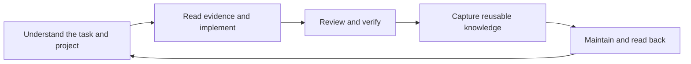

# Architecture and evidence boundaries

The native Codex plugin supplies three skills. The installed Python runtime supplies
the local knowledge service. Project profiles remain independent of chip families or
an editor. Private path bindings belong to the local registry.

Each stdio MCP process is bound to one immutable knowledge configuration. It exposes
search, original evidence, feedback, capture, maintenance submission, job status and
cancellation. A retrieved document never becomes an instruction or an authorization.

Maintenance is a durable local SQLite queue. An independent runner, started by the
installer or the user's terminal, launches each bounded maintenance supervisor. Windows
MCP hosts can put their entire child process tree into a kill-on-close Job Object;
ordinary detached subprocesses therefore cannot guarantee maintenance survives an MCP
disconnect. This product keeps that host policy intact and does not launch maintenance
supervisors as children of MCP. No network broker or arbitrary execution endpoint exists.

The installer previews the per-user logon shortcut. It starts small local queue runners
without loading embedding models. With startup disabled, users start a runner explicitly
after login. The service reports an unavailable runner rather than accepting a task
that cannot execute.

New generations are validated before publishing one atomic pointer. Evidence IDs stay
bound to retained generations. Capture files use idempotent operation records and
expected content hashes. Feedback does not promote verification maturity.

An empty library, an unavailable index and failed text extraction are distinct states.
Snapshots include consistent SQLite backups and generations referenced by feedback.
Restore binds sources to the independent destination and never borrows the original
source directories to pass verification. Model files are a separately declared dependency.

Static checks, isolated tests, installed native calls, external receiver acceptance and
performance measurements are separate results. This development candidate does not yet
claim final release acceptance.
